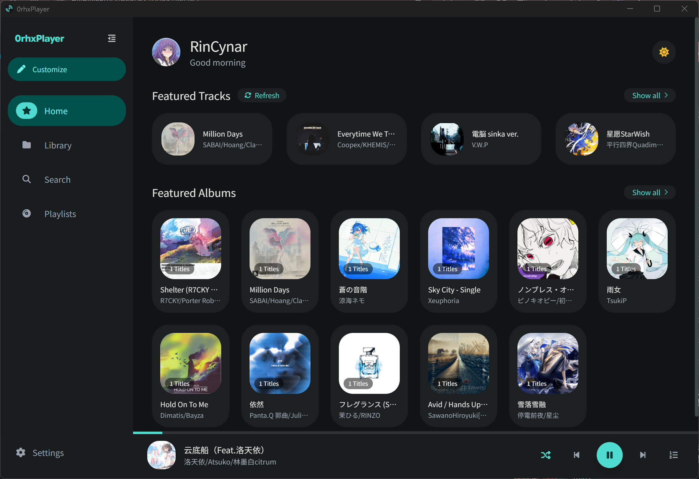
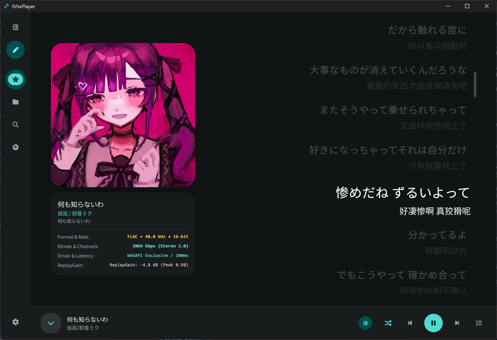
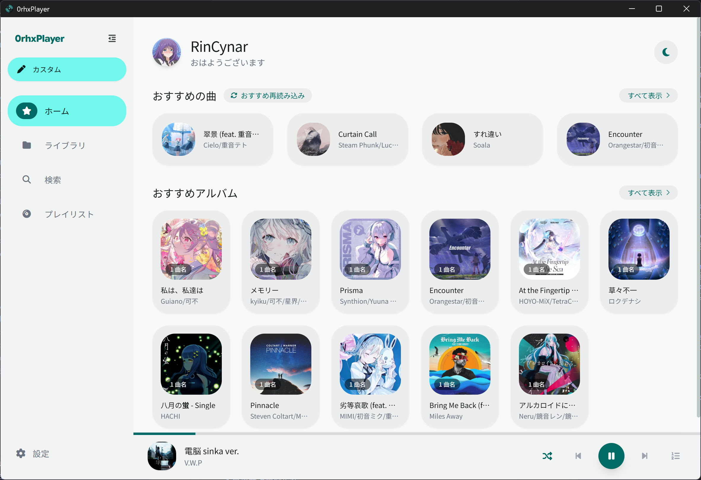
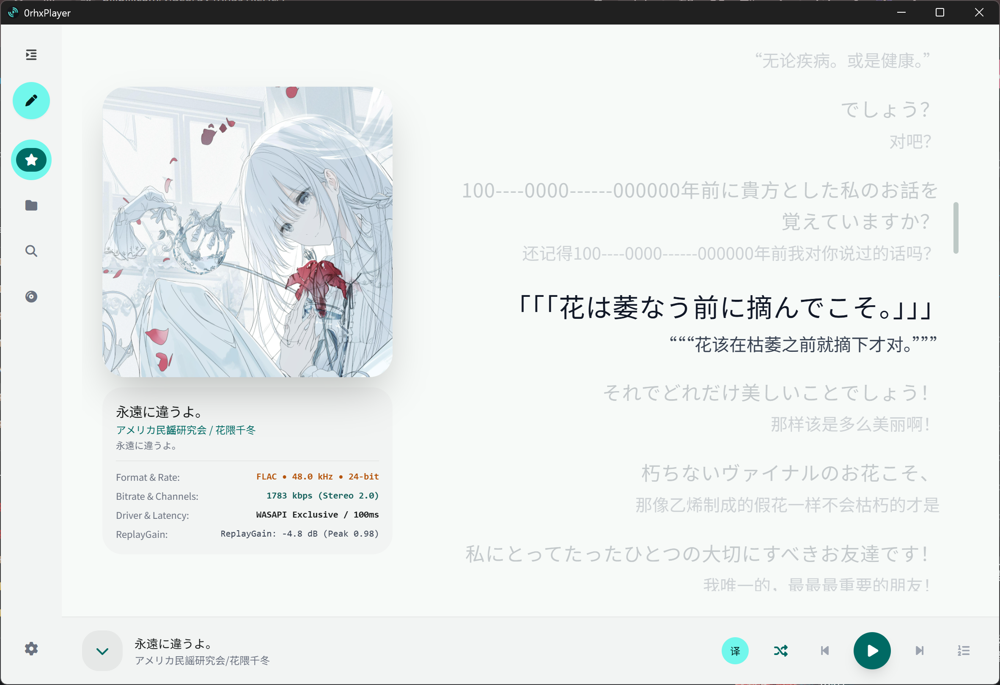

<div align="center">

# 🎵 0rhxPlayer Desktop

### 一个轻量、现代化、遵循 Material 3 设计的本地音乐播放器
**A Lightweight & Modern Material 3 Local Music Player for Desktop**

[](https://github.com/RinCynar/0rhxPlayer-Desktop/releases/latest)
[](https://0rhxplayer.rincynar.top)
[](https://tauri.app/)
[](https://www.rust-lang.org/)
[](https://react.dev/)
[](https://m3.material.io/)
[](LICENSE)

[🌐 官方主页 (Official Website)](https://0rhxplayer.rincynar.top) • [📦 版本下载 (Releases)](https://github.com/RinCynar/0rhxPlayer-Desktop/releases/latest) • [🧩 VSCode 插件版](https://github.com/RinCynar/0rhxPlayer)

[English](README.md) | **简体中文**

</div>

---

## 📌 项目简介 (About)

**0rhxPlayer Desktop** 是一款面向桌面端的本地音乐播放工具，采用 **Tauri 2 + Rust + React 19** 技术栈开发。

项目初衷是为日常听歌提供一个视觉清爽、交互流畅、内存开销适中且专注本地播放体验的客户端。界面设计遵循 **Google Material Design 3** 规范并采用初音绿（`#39C5BB`）为主色调，支持主流无损与有损音频格式解码、动态歌词展示与基础均衡器调节。

> [!NOTE]
> 本项目当前版本为 `v1.0.2`，仍处于持续迭代与优化阶段。如有遇到 Bug 或有改进建议，非常欢迎提交 [Issues](https://github.com/RinCynar/0rhxPlayer-Desktop/issues) 一起探讨交流！

---

## 📸 界面预览 (Screenshots)

<div align="center">

### 🌙 深色模式 (Dark Mode)

#### 1. 主页与推荐 (Home & Recommendations)
> 个性化问候、随机推荐单曲与专辑、动态主题调色及底部控制栏。



<br/>

#### 2. 沉浸式播放与双语歌词 (NowPlaying & Dual-line Lyrics)
> 专辑封面、音频基础参数（采样率、格式、驱动模式等）以及逐行双语对齐歌词。



<br/>

---

### ☀️ 浅色模式 (Light Mode)

#### 1. 主页与推荐 (Home & Recommendations)


<br/>

#### 2. 沉浸式播放与双语歌词 (NowPlaying & Dual-line Lyrics)


</div>

---

## 🛠️ 当前功能 (Features)

- **🎧 本地音频播放**：
  - 基于 Rust（`cpal` + `symphonia`）音频后端，支持 Windows WASAPI / DirectSound 与 Linux ALSA 输出。
  - 支持常见无损格式（FLAC、WAV、APE 等）与主流有损格式（MP3、AAC、OGG、Opus 等）解码。
  - 支持基础 ReplayGain 音量平衡与 CUE 分轨解析。
- **🎛️ 10 段基础均衡器 (EQ)**：
  - 提供 10 个常见频段增益调节（±12dB）与前级增益微调。
  - 内置 Flat、流行、摇滚、人声增强等基础预设。
- **📜 歌词与元数据解析**：
  - 支持读取外置 `.lrc` 文件与音频内置歌词标签。
  - 提供中/日双语翻译歌词同步呈现与滚动高亮。
  - 歌词支持字号调整与对齐方式切换（左/中/右）。
- **🎨 Material 3 视觉与动效**：
  - 基于 `#39C5BB` 种子色构建的浅色 / 深色双模式配色。
  - 引入 Material 3 标准缓动过渡与页面切换动效。
  - 基于虚拟滚动（`@tanstack/react-virtual`）与图片懒加载，优化曲库滑动性能。
- **🌐 国际化支持**：
  - 界面提供 **简体中文**、**English**、**日本語** 三语支持。

---

## 📥 获取与安装 (Download)

可在 **[GitHub Releases 页面](https://github.com/RinCynar/0rhxPlayer-Desktop/releases/latest)** 或 **[官方落地页](https://0rhxplayer.rincynar.top)** 获取对应系统的预编译包：

| 平台 (Platform) | 文件格式 (Format) | 说明 |
| :--- | :--- | :--- |
| **Windows (x64)** | `.exe` (安装包) / `.zip` (便携绿色版) | 适用于 64 位 Windows 10/11 |
| **Windows (ARM64)** | `.exe` (安装包) / `.zip` (便携绿色版) | 适用于 Surface Pro 等 ARM 设备 |
| **Linux (x64)** | `.AppImage` / `.tar.gz` (便携压缩包) | 适用于主流 x64 Linux 发行版 |

---

## 💻 本地运行与构建 (Build from Source)

### 依赖环境
- [Node.js](https://nodejs.org/) (>= 18) 与 [pnpm](https://pnpm.io/)
- [Rust](https://www.rust-lang.org/) (>= 1.75) 与 Cargo
- [Tauri 2 依赖项](https://tauri.app/v2/guides/getting-started/prerequisites/)

### 步骤
```bash
# 1. 克隆代码
git clone https://github.com/RinCynar/0rhxPlayer-Desktop.git
cd 0rhxPlayer-Desktop

# 2. 安装前端依赖
pnpm install

# 3. 本地调试运行
pnpm tauri dev

# 4. 构建发布产物
pnpm tauri build
```

---

## 🔗 相关项目 (Related)

- **VSCode 插件版**: [0rhxPlayer for VSCode](https://github.com/RinCynar/0rhxPlayer)（可在 VSCode 插件市场搜索 `0rhxplayer` 安装）
- **官方落地页**: [https://0rhxplayer.rincynar.top](https://0rhxplayer.rincynar.top)

---

## 📄 许可证 (License)

本项目遵循 **[GPL-3.0 License](LICENSE)** 开源协议。

Copyright © 2026 [RinCynar](https://github.com/RinCynar).
